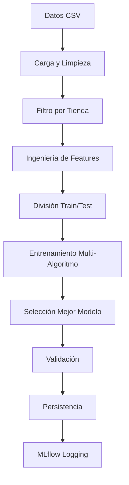
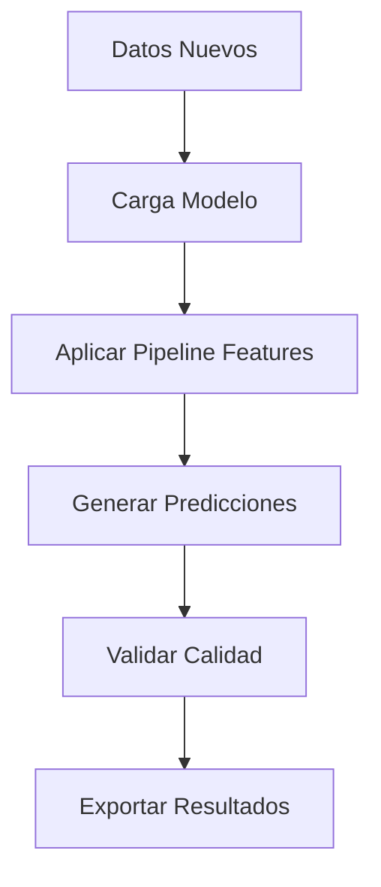

# Documentación del Sistema de Modelamiento LifeMiles

## Descripción General del Proyecto

Este proyecto tiene como objetivo desarrollar un sistema de modelos de machine learning para predecir las ventas (`billings`) en los puntos de venta de las marcas aliadas de LifeMiles. Utilizando datos históricos de transacciones, como montos, millas acumuladas, comercios y comportamiento del socio (cliente), el sistema generará pronósticos de ventas a nivel de tienda, marca y/o cliente.

### Objetivos del Sistema
- **Variable objetivo principal**: `billings` (ventas/facturación)
- **Nivel de predicción**: Por tienda individual (store_id)
- **Horizonte temporal**: Predicciones futuras basadas en patrones históricos
- **Aplicaciones**: Optimización de estrategias de marketing, personalización de ofertas, gestión de inventarios y fortalecimiento de la lealtad de clientes

## Arquitectura del Sistema

### Estructura de Directorios

```
Modelamiento/
├── model/                              # Paquete principal del modelo
│   ├── config/                         # Configuraciones
│   │   ├── core.py                     # Configuración base
│   │   ├── improved_config.yml         # Configuración avanzada
│   │   └── mlflow_config.py            # Configuración MLflow
│   ├── processing/                     # Procesamiento de datos
│   │   ├── data_manager.py             # Gestión de datos
│   │   ├── features_improved.py        # Ingeniería de características
│   │   └── validation.py               # Validaciones
│   ├── datasets/                       # Datos de entrenamiento
│   ├── trained/                        # Modelos entrenados
│   ├── config.yml                      # Configuración principal
│   ├── pipeline_improved.py            # Pipeline de predicción
│   ├── predict_improved.py             # Módulo de predicción
│   └── train_pipeline_improved.py      # Pipeline de entrenamiento
├── requirements/                       # Dependencias
│   ├── requirements.txt                # Dependencias principales
│   ├── test_requirements.txt           # Dependencias de testing
│   └── typing_requirements.txt         # Dependencias de tipos
├── tests/                              # Tests unitarios
├── mlruns/                             # Experimentos MLflow
├── scripts de ejecución/               # Scripts principales
└── herramientas de análisis/           # Utilidades
```

## Componentes Principales

### 1. Scripts de Ejecución Principal

#### `run_improved_training.py`
**Propósito**: Script principal para ejecutar el entrenamiento de modelos

**Características**:
- Entrena modelos individuales por tienda
- Soporte para entrenamiento limitado (testing/debugging)
- Configuración flexible de parámetros
- Integración completa con MLflow
- Métricas de rendimiento automáticas

**Uso**:
```bash
# Entrenar todas las tiendas (producción)
python run_improved_training.py

# Entrenar solo 1 tienda (testing)
python run_improved_training.py --n 1

# Entrenar 10 tiendas (debugging)
python run_improved_training.py --n 10

# Configurar mínimo de muestras por tienda
python run_improved_training.py --min-samples 50
```

#### `run_improved_predictions.py`
**Propósito**: Script principal para generar predicciones

**Características**:
- Carga modelos entrenados automáticamente
- Genera predicciones para tiendas específicas o todas
- Exporta resultados en CSV
- Validación de calidad de predicciones

### 2. Módulo de Configuración (`model/config/`)

#### `config.yml`
**Configuración principal del sistema**:

```yaml
# Variable objetivo
target: billings

# Features principales organizadas por categoría
base_features:          # Características temporales básicas
advanced_temporal_features:  # Características temporales avanzadas
lag_features:          # Valores históricos (lag 1, 2, 3, 7, 14, 30 días)
rolling_features:      # Estadísticas móviles (media, desviación estándar)
trend_features:        # Características de tendencia
volatility_features:   # Características de volatilidad
seasonal_features:     # Características estacionales
growth_features:       # Características de crecimiento
```

#### `improved_config.yml`
Configuración avanzada con hiperparámetros optimizados para diferentes algoritmos.

#### `mlflow_config.py`
Configuración de MLflow para tracking de experimentos.

### 3. Procesamiento de Datos (`model/processing/`)

#### `data_manager.py`
**Funciones principales**:
- `load_dataset()`: Carga y estandariza datasets
- `save_pipeline()`, `load_pipeline()`: Persistencia de pipelines
- Mapeo automático de columnas
- Creación de identificadores únicos de tienda

#### `features_improved.py`
**Ingeniería de características avanzada**:
- **Features temporales**: año, mes, día de la semana, trimestre, etc.
- **Features de lag**: valores históricos (1, 2, 3, 7, 14, 30 días)
- **Features de rolling**: estadísticas móviles (media, std) en ventanas de 7 y 30 días
- **Features de tendencia**: cambios porcentuales en diferentes períodos
- **Features de volatilidad**: medidas de variabilidad
- **Features estacionales**: patrones cíclicos
- **Features de crecimiento**: tasas de crecimiento

#### `validation.py`
Validaciones de calidad de datos y consistencia.

### 4. Pipeline de Entrenamiento (`train_pipeline_improved.py`)

#### Arquitectura del Pipeline
1. **Carga y preprocessamiento de datos**
2. **Filtrado por tienda individual**
3. **Ingeniería de características automatizada**
4. **Entrenamiento de múltiples algoritmos**:
   - Random Forest
   - Gradient Boosting
   - XGBoost
   - LightGBM
   - Linear Regression
5. **Selección automática del mejor modelo**
6. **Validación y métricas de calidad**
7. **Persistencia del modelo ganador**

#### Métricas de Evaluación
- **R² Score**: Coeficiente de determinación (objetivo: ≥0.8)
- **SMAPE**: Error porcentual absoluto medio simétrico (objetivo: ≤10%)
- **MAE**: Error absoluto medio
- **RMSE**: Error cuadrático medio
- **Clasificación de calidad**: EXCELENTE, BUENO, ACEPTABLE, POBRE

#### Integración MLflow
- Logging automático de parámetros y métricas
- Tracking de experimentos por tienda
- Comparación de modelos
- Gestión de artefactos

### 5. Pipeline de Predicción (`predict_improved.py`)

#### Funcionalidades
- Carga automática de modelos entrenados
- Generación de predicciones para nuevos datos
- Aplicación automática del pipeline de features
- Validación de calidad de predicciones

### 6. Herramientas de Análisis

#### `mlflow_explorer.py`
**Explorador de experimentos MLflow**:
```bash
# Servidor web MLflow
python mlflow_explorer.py --serve

# Análisis de experimentos
python mlflow_explorer.py --analysis

# Comparación de modelos
python mlflow_explorer.py --compare
```

#### `show_predictions_table.py`
Visualización de predicciones en formato tabular.

#### `test_predictions.py`
Testing de predicciones y validación de calidad.

### 7. Sistema de Testing (`tests/`)

Tests unitarios para validación de componentes:
- Test de predicciones
- Validación de pipelines
- Test de consistencia de datos

## Flujo de Trabajo

### 1. Entrenamiento de Modelos



### 2. Generación de Predicciones



## Configuración del Ambiente

### Dependencias Principales
```txt
pandas>=1.5.0
scikit-learn>=1.1.0
xgboost>=1.6.0
lightgbm>=3.3.0
mlflow>=2.0.0
joblib>=1.2.0
pyyaml>=6.0
```

### Setup del Proyecto
```bash
# Instalar dependencias
pip install -r requirements/requirements.txt

# Configurar ambiente Python
python -m venv venv
source venv/bin/activate  # Linux/Mac
venv\Scripts\activate     # Windows

# Instalar paquete en modo desarrollo
pip install -e .
```

## Uso del Sistema

### Entrenamiento Completo
```bash
# Entrenamiento completo (todas las tiendas)
python run_improved_training.py

# Revisar resultados en MLflow
python mlflow_explorer.py --serve
```

### Predicciones
```bash
# Generar predicciones
python run_improved_predictions.py

# Ver resultados
python show_predictions_table.py
```

### Monitoreo y Análisis
```bash
# Explorar experimentos
python mlflow_explorer.py --analysis

# Testing de predicciones
python test_predictions.py
```

## Objetivos de Rendimiento

### Métricas Objetivo
- **R² Score**: ≥ 0.8 (excelente ajuste)
- **SMAPE**: ≤ 10% (error bajo)
- **Cobertura**: ≥ 80% de tiendas con modelos de calidad BUENA o superior

### Clasificación de Calidad
- **EXCELENTE**: R² ≥ 0.9 y SMAPE ≤ 5%
- **BUENO**: R² ≥ 0.8 y SMAPE ≤ 10%
- **ACEPTABLE**: R² ≥ 0.6 y SMAPE ≤ 15%
- **POBRE**: Por debajo de los anteriores

## Deployment y Producción

### Ambiente de Desarrollo
- MLflow para tracking de experimentos
- Notebooks Jupyter para análisis exploratorio
- Testing automatizado

### Ambiente de Producción (AWS)
- MySQL para almacenamiento de datos procesados
- Automatización de entrenamiento
- Ejecución continua de predicciones
- Monitoreo de modelos

## Troubleshooting

### Problemas Comunes

1. **Error de variables no definidas**: Verificar scope de variables en funciones
2. **Modelos que no entrenan**: Verificar calidad y cantidad de datos por tienda
3. **Predicciones inconsistentes**: Validar pipeline de features
4. **MLflow no guarda**: Verificar configuración de tracking URI

### Logs y Debugging
- Logs detallados en cada etapa del pipeline
- Modo verbose para debugging
- Tracking completo en MLflow
- Tests automatizados para validación

## Contacto y Soporte

Para dudas o soporte técnico, consultar:
- Documentación de MLflow: `MLflow_README.md`
- Tests unitarios en `tests/`
- Configuraciones en `model/config/`

---

*Este documento describe la implementación completa del sistema de forecasting de LifeMiles para predicción de billings por tienda.*
